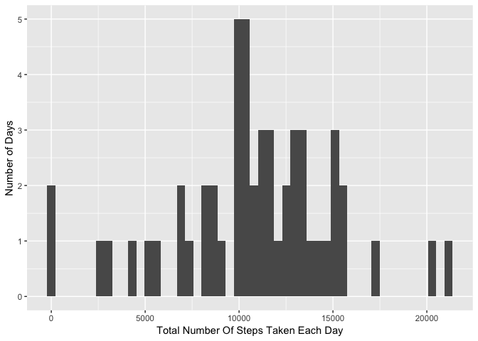
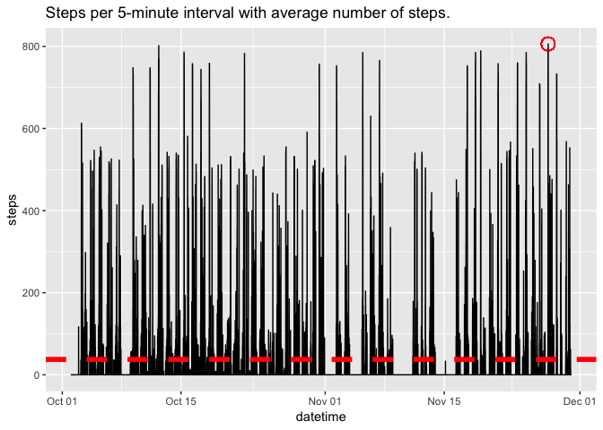
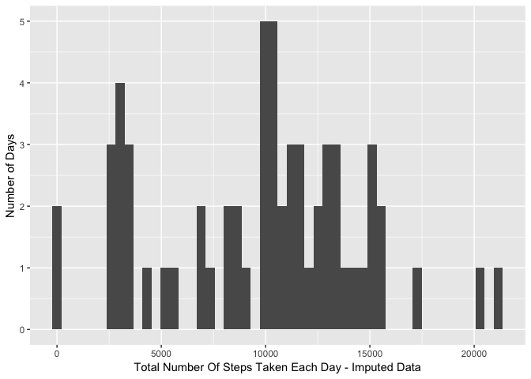
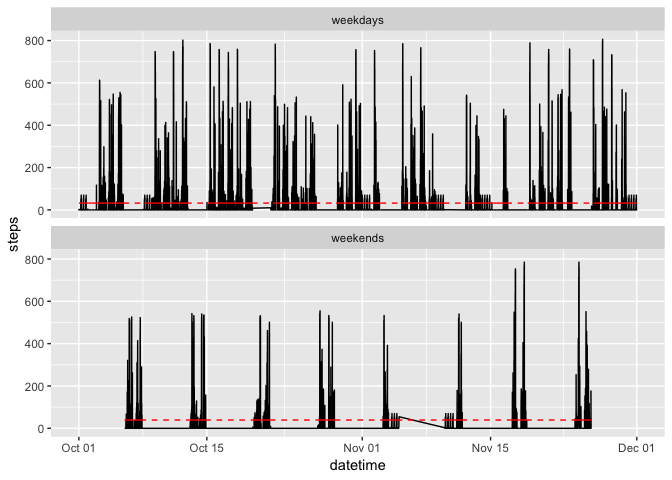

## Loading and preprocessing the data
* Load data an convert date and intermal into datetime object.

```r
#Load libraries
library(dplyr)
```

```
## 
## Attaching package: 'dplyr'
```

```
## The following objects are masked from 'package:stats':
## 
##     filter, lag
```

```
## The following objects are masked from 'package:base':
## 
##     intersect, setdiff, setequal, union
```

```r
#Load data
activityData <- read.csv( unz("activity.zip", filename = "activity.csv"))
#convert date to date object
activityData$date <- as.Date(activityData$date,format='%Y-%m-%d')
#convert interval to time object (24 hours)
temp2 <- mapply(function(x, y) paste0(rep(x, y), collapse = ""), 0, 4 - nchar(activityData$interval))
temp <- paste0(temp2, activityData$interval)
temp <- format(strptime(temp, format="%H%M"), format = "%H:%M")
# Combine date/time in a new column
activityData$datetime <- as.POSIXct(paste(activityData$date, temp), format="%Y-%m-%d %H:%M")

#convert data to dataframe
activityData <- as.data.frame(activityData)
summary(activityData)
```

```
##      steps             date               interval     
##  Min.   :  0.00   Min.   :2012-10-01   Min.   :   0.0  
##  1st Qu.:  0.00   1st Qu.:2012-10-16   1st Qu.: 588.8  
##  Median :  0.00   Median :2012-10-31   Median :1177.5  
##  Mean   : 37.38   Mean   :2012-10-31   Mean   :1177.5  
##  3rd Qu.: 12.00   3rd Qu.:2012-11-15   3rd Qu.:1766.2  
##  Max.   :806.00   Max.   :2012-11-30   Max.   :2355.0  
##  NA's   :2304                                          
##     datetime                  
##  Min.   :2012-10-01 00:00:00  
##  1st Qu.:2012-10-16 05:58:45  
##  Median :2012-10-31 11:57:30  
##  Mean   :2012-10-31 12:23:59  
##  3rd Qu.:2012-11-15 17:56:15  
##  Max.   :2012-11-30 23:55:00  
## 
```

```r
pctMissingSteps = round(sum(is.na(activityData$steps)) / dim(activityData)[1] *100,2)
```
* Remove rows with NA's in steps column.

We could set NA's values on the steps column to the median, which is zero, or we could remove those NA's row.  However, I choose to remove those NA's considering that NA's is only 13.11 % of the data.  This avoids including any bias into the analysis by using the actual data available.


```r
filteredData <- activityData%>%
  na.omit()
```


## What is mean total number of steps taken per day?

* let's calculate the total number of steps taken per day

```r
totalNumStepsPerDay <- filteredData %>%
  group_by(date) %>%
  summarize(totalSteps = sum(steps))
head(totalNumStepsPerDay)
```

```
## # A tibble: 6 x 2
##   date       totalSteps
##   <date>          <int>
## 1 2012-10-02        126
## 2 2012-10-03      11352
## 3 2012-10-04      12116
## 4 2012-10-05      13294
## 5 2012-10-06      15420
## 6 2012-10-07      11015
```
* let's draw a histogram of the total number of steps taken each day

```r
library(ggplot2)
qplot(totalNumStepsPerDay$totalSteps,geom="histogram",bins = 50) + xlab("Total Number Of Steps Taken Each Day") + ylab("Number of Days")
```

<!-- -->

Now let's calculate and report the mean and median of the total number of steps taken per day
* Mean

```r
meanNumStepsPerDay <- filteredData %>%
  group_by(date) %>%
  summarize(meanSteps = mean(steps))

head(meanNumStepsPerDay)  
```

```
## # A tibble: 6 x 2
##   date       meanSteps
##   <date>         <dbl>
## 1 2012-10-02     0.438
## 2 2012-10-03    39.4  
## 3 2012-10-04    42.1  
## 4 2012-10-05    46.2  
## 5 2012-10-06    53.5  
## 6 2012-10-07    38.2
```

```r
meanTotalNumStepsPerDay <- round(mean(totalNumStepsPerDay$totalSteps),4)
```

Mean of the total number of steps taken per day:
1.0766189\times 10^{4}

* Median

```r
medianNumStepsPerDay <- filteredData %>%
  group_by(date) %>%
  summarize(medianSteps = median(steps))

head(medianNumStepsPerDay)  
```

```
## # A tibble: 6 x 2
##   date       medianSteps
##   <date>           <dbl>
## 1 2012-10-02           0
## 2 2012-10-03           0
## 3 2012-10-04           0
## 4 2012-10-05           0
## 5 2012-10-06           0
## 6 2012-10-07           0
```

```r
medianTotalNumStepsPerDay <- median(totalNumStepsPerDay$totalSteps)
```

Median of the total number of steps taken per day:
10765


## What is the average daily activity pattern?

Moving forward, let's plot the time series of the 5-minute interval and also the average number of steps across all days:

```r
meanNumStepsPer5MinsInterval <- mean(filteredData$steps)

maxNumStepsInterval <- filteredData %>%
  filter(filteredData$steps == max(filteredData$steps)) %>%
  select(datetime,steps)

ggplot(filteredData,aes(x=datetime,y=steps)) +
  geom_line() +
  geom_hline(yintercept=meanNumStepsPer5MinsInterval,color="red",size=2,linetype=2) +
  geom_point(aes(x=maxNumStepsInterval$datetime,y=maxNumStepsInterval$steps),color="red",size=5,shape=1) + 
  ggtitle("Steps per 5-minute interval with average number of steps.")
```

<!-- -->


```r
maxNumStepsInterval <- maxNumStepsInterval %>%
  select(datetime)
```
From the graph, we can see that the 5-minute interval with the maximum number of steps is: 2012-11-27 06:15:00

## Imputing missing values
First, let's calculate and report the total number of missing values in the dataset:

```r
totalNumMissing <- sum(is.na(activityData$steps))
pctMissingSteps <- round( totalNumMissing / dim(activityData)[1] *100,2)
```
We have 2304 rows ( 13.11% ) with missing values in the steps column.

To fill in those missing values, let's use the mean value of each particular interval:

```r
## Calculate the mean for each interval
intervalMeans <- activityData %>%
  na.omit() %>%
  group_by(interval) %>%
  summarize(intervalMeanSteps = mean(steps))

## replace NA's with the mean for that interval
imputedData <- activityData
imputedData$steps <- ifelse(is.na(activityData$steps) == TRUE, intervalMeans$intervalMeanSteps[intervalMeans$interval %in% activityData$steps], activityData$steps)
head(imputedData)
```

```
##       steps       date interval            datetime
## 1 1.7169811 2012-10-01        0 2012-10-01 00:00:00
## 2 0.3396226 2012-10-01        5 2012-10-01 00:05:00
## 3 0.1320755 2012-10-01       10 2012-10-01 00:10:00
## 4 0.1509434 2012-10-01       15 2012-10-01 00:15:00
## 5 0.0754717 2012-10-01       20 2012-10-01 00:20:00
## 6 2.0943396 2012-10-01       25 2012-10-01 00:25:00
```

```r
summary(imputedData)
```

```
##      steps             date               interval     
##  Min.   :  0.00   Min.   :2012-10-01   Min.   :   0.0  
##  1st Qu.:  0.00   1st Qu.:2012-10-16   1st Qu.: 588.8  
##  Median :  0.00   Median :2012-10-31   Median :1177.5  
##  Mean   : 33.87   Mean   :2012-10-31   Mean   :1177.5  
##  3rd Qu.: 10.00   3rd Qu.:2012-11-15   3rd Qu.:1766.2  
##  Max.   :806.00   Max.   :2012-11-30   Max.   :2355.0  
##     datetime                  
##  Min.   :2012-10-01 00:00:00  
##  1st Qu.:2012-10-16 05:58:45  
##  Median :2012-10-31 11:57:30  
##  Mean   :2012-10-31 12:23:59  
##  3rd Qu.:2012-11-15 17:56:15  
##  Max.   :2012-11-30 23:55:00
```

Now, let's create a histogram of the dataset after imputation:

First we calculate the total number of steps per day with the imputed data:

```r
totalNumStepsPerDayImputed <- imputedData %>%
  group_by(date) %>%
  summarize(totalSteps = sum(steps))
head(totalNumStepsPerDayImputed)
```

```
## # A tibble: 6 x 2
##   date       totalSteps
##   <date>          <dbl>
## 1 2012-10-01      2556.
## 2 2012-10-02       126 
## 3 2012-10-03     11352 
## 4 2012-10-04     12116 
## 5 2012-10-05     13294 
## 6 2012-10-06     15420
```

Second, let's see the histogram of the imputed data:

```r
qplot(totalNumStepsPerDayImputed$totalSteps,geom="histogram",bins = 50) + xlab("Total Number Of Steps Taken Each Day - Imputed Data") + ylab("Number of Days")
```

<!-- -->

Third, let's calculate the mean and median and compare it to the previous values:
* Mean

```r
meanNumStepsPerDayImputed <- imputedData %>%
  group_by(date) %>%
  summarize(meanSteps = mean(steps))

head(meanNumStepsPerDayImputed)  
```

```
## # A tibble: 6 x 2
##   date       meanSteps
##   <date>         <dbl>
## 1 2012-10-01     8.88 
## 2 2012-10-02     0.438
## 3 2012-10-03    39.4  
## 4 2012-10-04    42.1  
## 5 2012-10-05    46.2  
## 6 2012-10-06    53.5
```

```r
meanTotalNumStepsPerDayImputed <- round(mean(totalNumStepsPerDayImputed$totalSteps),4)
```

Mean of the total number of steps taken per day in the imputed data:
9754.7127

* Median

    

```r
medianNumStepsPerDayImputed <- imputedData %>%
  group_by(date) %>%
  summarize(medianSteps = median(steps))

head(medianNumStepsPerDayImputed)  
```

```
## # A tibble: 6 x 2
##   date       medianSteps
##   <date>           <dbl>
## 1 2012-10-01       0.604
## 2 2012-10-02       0    
## 3 2012-10-03       0    
## 4 2012-10-04       0    
## 5 2012-10-05       0    
## 6 2012-10-06       0
```

```r
medianTotalNumStepsPerDayImputed <- median(totalNumStepsPerDayImputed$totalSteps)
```

Median of the total number of steps taken per day:
1.0395\times 10^{4}


Now, let's calculate the mean/median percent difference for the available data and the imputed data:


```r
pctDiffMean <- round((meanTotalNumStepsPerDay - meanTotalNumStepsPerDayImputed) / meanTotalNumStepsPerDay,2) *100
pctDiffMedian <- round((medianTotalNumStepsPerDay - medianTotalNumStepsPerDayImputed) / medianTotalNumStepsPerDay,2) *100
```

The percent difference for the mean is: 9% and for the median is: 3%.  This difference tells us that making this imputation increases bias on our data by changing the mean and the median.  

If we look at the histograms, we can see that the imputed data histogram is similar to the first histogram, with a big difference in the number of days between the range of 2500-3800 steps. Accordingly, we might be inclined on using the data that omits missing values and not the imputed data, only using available data for our analysis, if we consider this change is not representative of the real steps behavior.  

On the contrary, if we feel that replacing the missing NA's with the average values of the intervals is representative for the steps behavior in those intervals, we might be inclined in using the imputed data.  

Considering that we have more than 85% of the data without missing values, I'm inclined in using the imputed data for any further analysis as it should be representative of the steps behavior.


## Are there differences in activity patterns between weekdays and weekends?

For this section, let's create new factors that identifies weekday and weekend data:

```r
library(lubridate)
```

```
## 
## Attaching package: 'lubridate'
```

```
## The following object is masked from 'package:base':
## 
##     date
```

```r
weekData <- imputedData %>%
  mutate(
  weekdayType = as.factor(ifelse(wday(imputedData$date) %in% list(2, 3, 4, 5, 6), "weekdays","weekends") )
  )
```

Then, we can plot the weekday and weekend number of steps per 5-minute interval:

```r
## calculate the average for each type
weekendStepsMean <-  weekData %>%
  filter(weekdayType == "weekends") %>%
  summarize(mean(steps))

weekdayStepsMean <-  weekData %>%
  filter(weekdayType == "weekdays") %>%
  summarize(mean(steps))

## add averages to weekData

weekData$avgWeekdayType <- ifelse(weekData$weekdayType == "weekdays",unlist(weekdayStepsMean),unlist(weekendStepsMean) )
## plot data
ggplot(weekData,aes(x=datetime,y=steps))+
  facet_wrap(~weekdayType,nrow = 2) +
  geom_line() +
  geom_line(aes(x=datetime,y=avgWeekdayType),color="red",linetype=2)
```

<!-- -->
